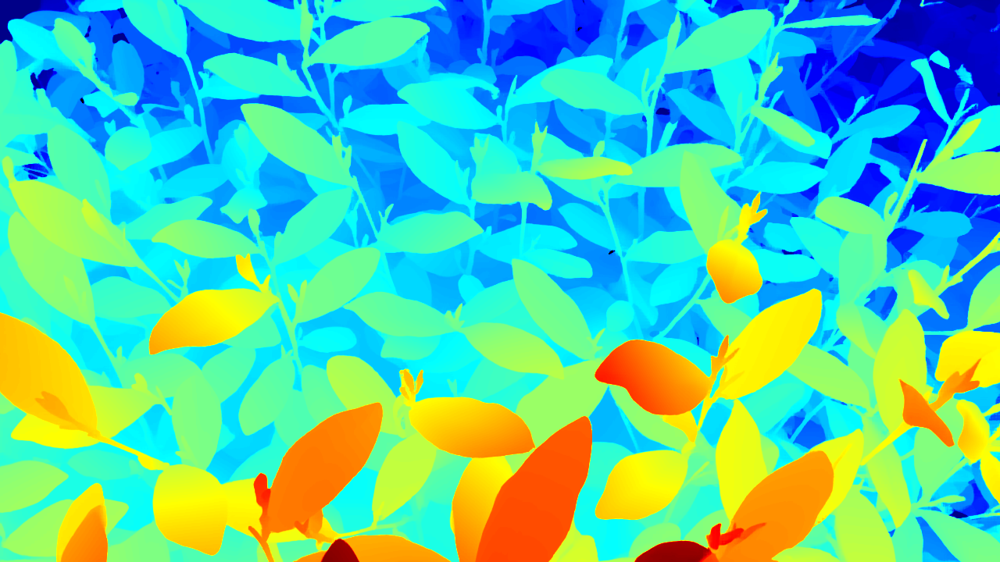
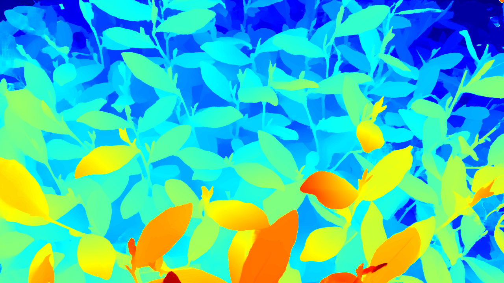
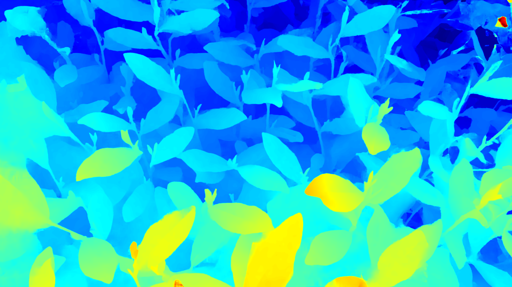
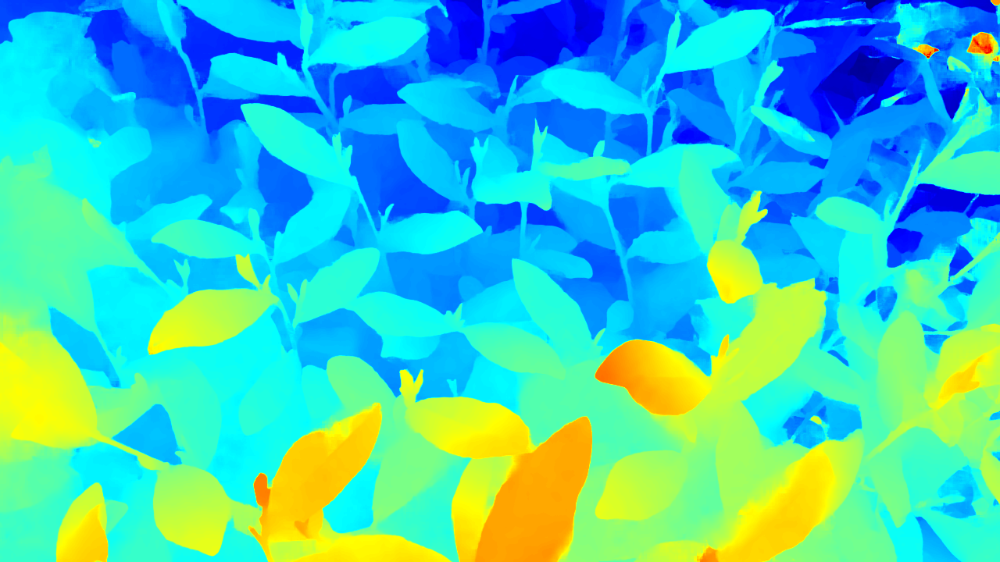
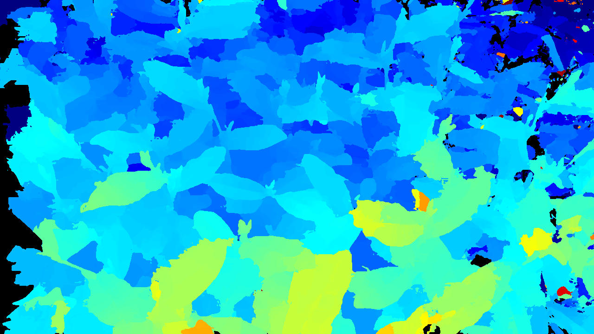
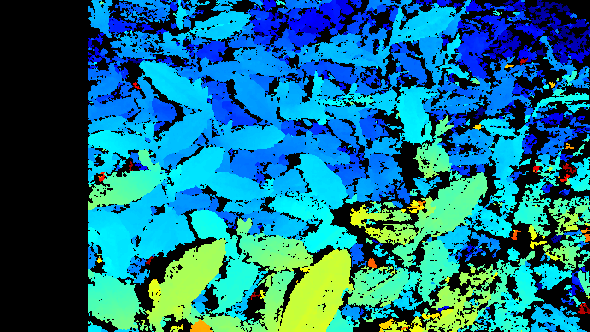

# tea_stereo_matching

## 🌼 Description
​**主要包含以下功能模块：​**</br>
* ​**双目相机标定**：包括双目相机标定、手眼标定等</br>
* ​**双目立体匹配**：包括极线校正、视差计算、视差图转深度图等</br>
* ​**XYZ3D 双目相机控制**：包括图像采集、曝光控制、ISO 增益控制等</br>

### 📁 File Tree
```
├── /tea_stereo_matching
    ├── 3rdParty
    ├── demo-imgs
    ├── demo-output
    ├── include
    ├── models
        ├── FFLONet_it32_cuda12.trt
        ├── FFLONet_DepthAny_it32_cuda12.trt
        ├── rt_FFLONet_it08_cuda12.trt
        ├── rt_FFLONet_it32_cuda12.trt
        ├── ...
    ├── props
    ├── source
    ├── yml
    ├── README.md
```

### ⚙️ Hardware
* ​**Processor**: Intel Core i7-12700H @ 2.70GHz  
* ​**Graphics**: NVIDIA GeForce RTX 3060 Laptop GPU

### ⚙️ Installation
* ​**IDE**: Visual Studio 2026
* **Language**: C++20, OpenMP

### ⏳ Dependencies
* ​**CUDA 12.9**  
* ​**CUDNN 9.13**  
* ​**OpenCV 4.13.0**
* ​**ONNXRUNTIME 1.18.1**
* **TensorRT 10.13**
* **PCL 1.13.0**

## 📸 Calibration
`calib.h` 中包含以下相关类：</br>
* `calib::StereoCalibrate`：双目相机标定</br>
* `calib::StereoHandEyeAXXB`：双目手眼标定 Eye-to-Hand, AXXB</br>
* `calib::StereoHandEyeSVD`：双目手眼标定 Eye-to-Hand, SVD</br>
### 📝 Stereo Camera Calibration with Chessboard
调用 `calib::StereoCalibrate` 类进行标定，标定结果保存在以下文件中：  
* ​**双目相机参数**：`*/stereo.yaml`</br>
``` cpp
#include "../include/calib.h"
#include <opencv2/opencv.hpp>
int main()
{
    calib::StereoCalibrate sc;
    sc.setChessboardParams(ChessboardParams(11, 8, 6.f));
    sc.loadChessboardImages("../demo-imgs/calib/*", false);
    sc.calibrate();
    sc.writeYAMLFile();
    return 0;
}
```

### 📝 Stereo Camera & 6-DOF Robot Hand-Eye Calibration
调用 `calib::StereoHandEyeAXXB` 类进行标定，标定结果保存在以下文件中：</br>
* ​**变换矩阵**：`*/TMatrix.yaml`</br>

``` cpp
#include "../include/calib.h"
#include <opencv2/opencv.hpp>
int main()
{
    calib::StereoHandEyeAXXB he;
    he.setChessboardParams(ChessboardParams(11, 8, 6.f));
    he.loadChessboardImages("../demo-imgs/calib/*.bmp");
    he.loadXYZRPYFile("../demo-imgs/calib/HandEye.csv");
    he.calibrateEyeToHand();
    he.writeYAMLFile();
    return 0;
}
```

**🤗注意：** SVD手眼标定需要开启增强指令，**配置方法**：</br>
(1) 打开项目属性</br>
(2) 选择 ​**C/C++** -> ​**代码生成**</br>
(3) 启用 ​**启用增强指令集**，设置为 ​**高级矢量扩展 (X86/X64) (/arch:AVX)**</br>
``` cpp
#include "../include/calib.h"
#include <opencv2/opencv.hpp>
int main()
{
    calib::StereoHandEyeSVD calib;
    calib.loadImages("../demo-imgs/20240316HandEyeSVD/left/*", "../demo-imgs/20240316HandEyeSVD/xyz/*");
    calib.loadXYZFile("../demo-imgs/20240316HandEyeSVD/HandEye.csv");
    calib.calibrate();
    calib.writeYAMLFile("../demo-imgs/20240316HandEyeSVD");
    return 0;
}
```

## 📸 Stereo Matching

### 📝 Bouguet Epipolar Rectification
调用`stereo::EpipolarRectify` 类进行极线校正图像，实现同名点行对齐</br>
``` cpp
#include "../include/stereo.h"
#include <opencv2/opencv.hpp>
int main()
{
    cv::Mat stereoImage = cv::imread("../demo-imgs/0071-Stereo.bmp");
    stereo::StereoParams params("../yml/stereo.yml");
    stereo::EpipolarRectify rectify(params.map, params.imgsz);
    cv::Mat rectifiedStereo;
    rectify.rectify(stereoImage, rectifiedStereo);
    auto imgWithLine = stereo::drawHorizontalLine(rectifiedStereo);
    cv::namedWindow("rectified", cv::WINDOW_NORMAL);
    cv::imshow("rectified", imgWithLine);
    cv::waitKey(0);
    return 0;
}
```

### 📝 ONNXRuntime (IGEV-Stereo, FFLO-Net, MonSter)
调用 `stereo::ONNXRuntimeInference` 类进行视差估计，采用 ONNX 模型推理，满足输入为左右图像且输出为视差图的 End-to-End 立体匹配模型通用</br>
**注意**：`onnxruntime = 1.18.1`，其他版本推理速度异常</br>
```cpp
#include "../include/stereo.h"
#include <opencv2/opencv.hpp>
int main()
{
    cv::Mat leftImage = cv::imread("../demo-imgs/0600-Left.bmp");
    cv::Mat rightImage = cv::imread("../demo-imgs/0600-Right.bmp");
    stereo::ONNXRuntimeInference onnx;
    onnx.loadModel("../models/FFLO_it32.onnx");
    cv::Mat disparity;
    onnx.compute(leftImage, rightImage, disparity);
    cv::Mat disparityColor;
    stereo::applyColorMap(disparity, disparityColor, stereo::JETColorMap());
    cv::imshow("disparity", disparityColor);
    cv::waitKey(0);
    return 0;
}
```

### 📝 TensorRT (FFLO-Net)
调用 `stereo::TensorRTInference` 类进行视差估计，采用 TensorRT 引擎推理</br>
```cpp
#include "../include/stereo.h"
#include <opencv2/opencv.hpp>
int main()
{
    cv::Mat leftImage = cv::imread("../demo-imgs/0600-Left.bmp");
    cv::Mat rightImage = cv::imread("../demo-imgs/0600-Right.bmp");
    stereo::TensorRTInference trt;
    trt.loadModel("../models/FFLONet_DepthAny_it32_cuda12.trt");
    cv::Mat disparity;
    trt.compute(leftImage, rightImage, disparity);
    cv::Mat disparityColor;
    stereo::applyColorMap(disparity, disparityColor, stereo::JETColorMap());
    cv::imshow("disparity", disparityColor);
    cv::waitKey(0);
    return 0;
}
```

### 📝 AD-Census
调用 `stereo::ADCensus` 类进行视差估计</br>
**🤗** 开启 OpenMP 体验更佳，**配置方法**：</br>
(1) 打开项目属性</br>
(2) 选择 ​**C/C++** -> ​**语言**</br>
(3) 启用 ​**OpenMP 支持**，设置为 ​**是 (/openmp)**</br>
``` cpp
#include "../include/stereo.h"
#include <opencv2/opencv.hpp>
int main()
{
    cv::Mat leftImage = cv::imread("../demo-imgs/0600-Left.bmp");
    cv::Mat rightImage = cv::imread("../demo-imgs/0600-Right.bmp");
    stereo::ADCensus adcensus;
    adcensus.setMatchingStrategy(stereo::ColorModel::RGB, false, false);
    adcensus.setMinMaxDisparity(0, 192);
    cv::Mat disparity;
    adcensus.compute(leftImage, rightImage, disparity);
    cv::Mat disparityColor;
    stereo::applyColorMap(disparity, disparityColor, stereo::JETColorMap());
    cv::imshow("disparity", disparityColor);
    cv::waitKey(0);
    return 0;
}
```

### 📝 SGBM
调用 `cv::StereoSGBM` 类进行视差估计</br>
``` cpp
#include "../include/stereo.h"
#include <opencv2/opencv.hpp>
int main()
{
    cv::Mat leftImage = cv::imread("../demo-imgs/0600-Left.bmp");
    cv::Mat rightImage = cv::imread("../demo-imgs/0600-Right.bmp");
    cv::Ptr<cv::StereoSGBM> sgbm = cv::StereoSGBM::create();
    sgbm->setMinDisparity(0);
    sgbm->setNumDisparities(192);
    sgbm->setBlockSize(3);
    sgbm->setP1(8 * 3 * 3 * 3);
    sgbm->setP2(32 * 3 * 3 * 3);
    sgbm->setDisp12MaxDiff(1);
    sgbm->setPreFilterCap(0);
    sgbm->setUniquenessRatio(10);
    sgbm->setSpeckleWindowSize(100);
    sgbm->setSpeckleRange(32);
    sgbm->setMode(cv::StereoSGBM::MODE_SGBM);
    cv::Mat disparity;
    sgbm->compute(leftImage, rightImage, disparity);
    disparity.convertTo(disparity, CV_32F, 1.0 / 16);
    cv::Mat disparityColor;
    stereo::applyColorMap(disparity, disparityColor, stereo::JETColorMap());
    cv::imshow("disparity", disparityColor);
    cv::waitKey(0);
    return 0;
}
```

### 🎨 Results
<div align="center">
    <div style="display: inline-block; width: 100%;">
        
        <p style="text-align: center; margin-top: 5px; color: #000000;">Left Image</p>
    </div>
    <div style="display: inline-block; width: 100%;">
        
        <p style="text-align: center; margin-top: 5px; color: #ff0000;">FFLONet</p>
    </div>
    <div style="display: inline-block; width: 100%;">
        
        <p style="text-align: center; margin-top: 5px; color: #ff00ff;">FFLONetDepthAny</p>
    </div>
        <div style="display: inline-block; width: 100%;">
        
        <p style="text-align: center; margin-top: 5px; color: #0000ff;">RTFFLONet</p>
    </div>
    <div style="display: inline-block; width: 100%;">
        
        <p style="text-align: center; margin-top: 5px; color: #0000ff;">RTFFLONet_it08</p>
    </div>
    <div style="display: inline-block; width: 100%;">
        
        <p style="text-align: center; margin-top: 5px; color: #0000ff;">RTFFLONet_INT8_it08</p>
    </div>
    <div style="display: inline-block; width: 100%;">
        
        <p style="text-align: center; margin-top: 5px; color: #0000ff;">RTFFLONetSim_INT8_it08</p>
    </div>
    <div style="display: inline-block; width: 100%;">
        
        <p style="text-align: center; margin-top: 5px; color: #ff00ff;">ADCensus</p>
    </div>
    <div style="display: inline-block; width: 100%;">
        
        <p style="text-align: center; margin-top: 5px; color: #ff00ff;">SGBM</p>
    </div>
</div>


| Method | FFLONet | FFLONetDepthAny | RTFFLONet | RTFFLONet_it08 | RTFFLONet_INT8_it08 | RTFFLONetSim_INT8_it08 |
|:-:|:-:|:-:|:-:|:-:|:-:|:-:|
| TensorRT </br>(RTX3060 Laptop) | 1233ms | 2490ms | 331ms | 161ms | 115ms | 107ms |

## 📸 Stereo Camera Capture
调用 `stereo::XYZ3D` 类控制XYZ3D双目相机</br>
``` cpp
#include "../include/camera.h"
#include <direct.h>
#include <conio.h>
int main()
{
    camera::XYZ3D xyz3d;
    try
    {
        xyz3d.connect();
        xyz3d.startCaptureThread();
        xyz3d.startLiveThread();
        xyz3d.startUSBDEVMonitor();
    }
    catch (...)
    {
        return -1;
    }
    int key = -1;
    do
    {
        if (_kbhit())
        {
            char ch = _getch();
            switch (ch)
            {
            case 27://"ESC"
                xyz3d.release();
                key = 27;
                break;
            case 'c': case 'C':
            {
                break;
            }
            default:
                break;
            }
        }
        std::this_thread::sleep_for(20ms);
    } while (key != 27);
    return 0;
}
```

## Camera
``` cpp
#include <iostream>
#include "./include/camera.h"
#include <chrono>

using namespace std::literals;

int main()
{
    std::string pidvid = "vid_2f9d&pid_0024";
    camera::WebCamera cam;
    cam.connect(pidvid, "", camera::ImageSize(640, 480), camera::DSHOW, camera::MJPG, 3);
    cam.startCaptureThread();
    cam.startLiveThread();
    //cam.writeFrame("test.png");
    //cam.startScheduledCapture("../Capture", 100ms);
    //cam.startRecording("../Record/test.avi");
    std::this_thread::sleep_for(10s);
    cam.release();
    return 0;
}
```

# Acknowledgements
This project is heavily based on [IGEV](https://github.com/gangweiX/IGEV), [ADCensus](https://doi.org/10.1109/ICCVW.2011.6130280), [StereoVision-ADCensus](https://github.com/DLuensch/StereoVision-ADCensus), We thank the original authors for their excellent work.